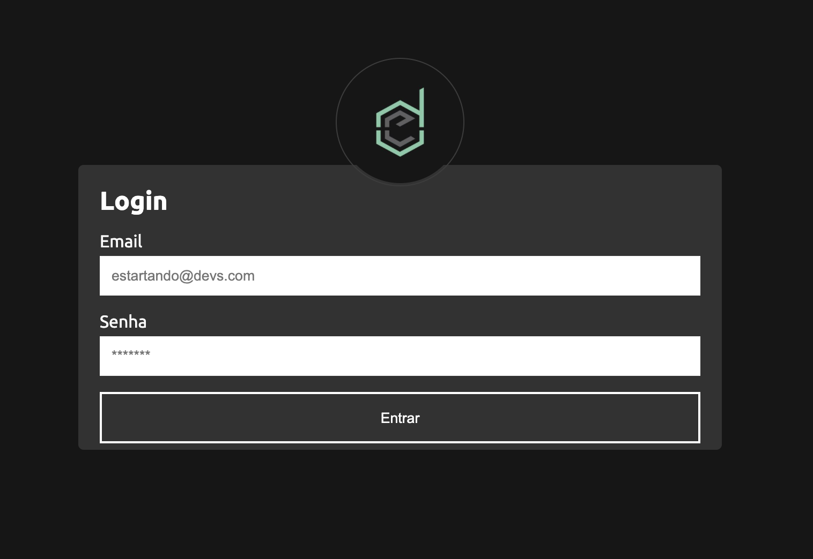

# RegisterDev

This fullstack project aimed to teach how to use the ReactJS Context API + useReducer(), and the project is based on a user registration/login to generate an authentication.



## How to use

- Backend 

```shell
$ cd backend
$ yarn // npm install
$ yarn dev // npm run dev
```

#### It is necessary to have the Docker installed and the postgresql image, as it is in ormconfig.

- Frontend 

```shell
$ cd frontend
$ yarn // npm install
$ yarn start // npm start
```


## Special Thanks

[Estartando Devs](https://estartandodevs.com.br/)

## Credits

Made by [Ramon Xavier](https://github.com/ramonxm) ✌🏻


